Kita akan mempelajari **POST-REDIRECT-GET (PRG) Pattern** - sebuah design
pattern fundamental dalam web development yang mencegah duplicate form
submissions dan meningkatkan user experience.

**Dan ini merupakan sesi terakhir dari Introduction to APIs**

## Masalah: Duplicate Form Submissions

Pernahkah Anda mengalami situasi ini saat browsing website?

1. Anda mengisi form (misalnya checkout pembelian)
2. Klik tombol "Submit"
3. Browser menampilkan halaman konfirmasi
4. Anda secara tidak sengaja menekan **F5 (refresh)**
5. Browser menampilkan warning: "Confirm Form Resubmission"

**Warning ini muncul karena browser mencoba mengirim ulang POST request yang
sama**, yang bisa menyebabkan:

- Pembelian ganda (charged twice)
- Data duplikat di database
- Email konfirmasi dikirim berkali-kali
- Inventory stock calculation error

### Diagram Masalah

```mermaid
flowchart TD
    A[User mengisi form] --> B[POST /checkout]
    B --> C[Server memproses]
    C --> D[Mengembalikan HTML page]
    D --> E[User menekan F5]
    E --> F{Browser bertanya:<br/>Resubmit form?}
    F -->|Ya| G[POST /checkout AGAIN!]
    G --> H[DUPLICATE ORDER ❌]
    F -->|Tidak| I[Batal]

    style H fill:#ff6b6b,stroke:#c92a2a
```



## Apa itu POST-REDIRECT-GET Pattern?

**POST-REDIRECT-GET (PRG)** adalah design pattern yang memecahkan masalah
duplicate submissions dengan menggunakan HTTP redirect setelah successful POST
request.

### Cara Kerja PRG Pattern

```
1. User submits form → POST /checkout
2. Server processes data (save to DB, send email, etc.)
3. Server sends REDIRECT response (302/303) → GET /success
4. Browser automatically makes GET request → GET /success
5. Server returns success page
6. User presses F5 → Browser only refreshes GET request
                   → NO duplicate submission! ✅
```


**Key concept**: Browser's last action adalah GET request, bukan POST. Jadi
ketika user refresh, browser hanya mengulangi GET request yang aman.

## Tanpa PRG Pattern (❌ Bad Practice)

```javascript
import express from "express";
const app = express();

app.use(express.urlencoded({ extended: true }));
app.set("view engine", "ejs");

// GET - Display form
app.get("/order", (req, res) => {
  res.render("order-form");
});

// POST - Process order (WRONG WAY!)
app.post("/order", (req, res) => {
  const { product, quantity } = req.body;

  // Process order (save to database, charge card, etc.)
  console.log("Processing order:", product, quantity);

  // ❌ PROBLEM: Directly rendering success page
  res.render("order-success", {
    product: product,
    quantity: quantity,
  });

  // Jika user refresh halaman ini, POST request akan terkirim lagi!
});

app.listen(3000);
```

**Masalah**: Ketika user berada di halaman success dan menekan F5, browser akan
menampilkan warning "Confirm Form Resubmission" dan jika user klik OK, order
akan diproses lagi!

## Dengan PRG Pattern (✅ Best Practice)

```javascript
import express from "express";
const app = express();

app.use(express.urlencoded({ extended: true }));
app.set("view engine", "ejs");

// Temporary storage (in production, use session/database)
let lastOrder = null;

// GET - Display form
app.get("/order", (req, res) => {
  res.render("order-form");
});

// POST - Process order (RIGHT WAY!)
app.post("/order", (req, res) => {
  const { product, quantity } = req.body;

  // Process order
  console.log("Processing order:", product, quantity);

  // Save order data temporarily
  lastOrder = {
    product: product,
    quantity: quantity,
    orderId: Date.now(),
    timestamp: new Date(),
  };

  // ✅ SOLUTION: Redirect to GET route
  res.redirect("/order/success");
});

// GET - Success page
app.get("/order/success", (req, res) => {
  if (!lastOrder) {
    return res.redirect("/order");
  }

  res.render("order-success", {
    order: lastOrder,
  });
});

app.listen(3000);
```

**Keuntungan**:

- User bisa refresh halaman success berkali-kali tanpa duplicate order
- No browser warning
- Better user experience
- URL di browser adalah GET route yang clean

## HTTP Redirect Status Codes

Ada beberapa HTTP status codes untuk redirect:

|         | Status Code        | Name                       | Description                 | Use Case |
| ------- | ------------------ | -------------------------- | --------------------------- | -------- |
| **301** | Moved Permanently  | Resource dipindah permanen | SEO redirects, URL changes  |
| **302** | Found              | Temporary redirect         | Default `res.redirect()`    |
| **303** | See Other          | Redirect POST to GET       | **Ideal untuk PRG pattern** |
| **307** | Temporary Redirect | Keeps HTTP method          | Redirect POST to POST       |

**Best practice untuk PRG**: Gunakan **303 See Other** karena explicitly
designed untuk redirect POST ke GET.

```
// Default redirect (302)
res.redirect('/success');

// Explicit 303 See Other (recommended for PRG)
res.redirect(303, '/success');
```

## Complete Example: Contact Form dengan PRG

### Server Implementation

```javascript
import express from "express";
import session from "express-session";

const app = express();

// Middleware
app.use(express.urlencoded({ extended: true }));
app.use(express.json());
app.set("view engine", "ejs");

// Session untuk flash messages
app.use(
  session({
    secret: "your-secret-key",
    resave: false,
    saveUninitialized: false,
    cookie: { maxAge: 60000 }, // 1 minute
  })
);

// Flash message middleware
app.use((req, res, next) => {
  res.locals.successMessage = req.session.successMessage;
  res.locals.errorMessage = req.session.errorMessage;
  delete req.session.successMessage;
  delete req.session.errorMessage;
  next();
});

// Database simulation
const messages = [];

// ============================================
// ROUTES
// ============================================

// GET - Contact form
app.get("/contact", (req, res) => {
  res.render("contact-form", {
    pageTitle: "Contact Us",
  });
});

// POST - Submit contact form (dengan PRG)
app.post("/contact", (req, res) => {
  const { name, email, message } = req.body;

  // Validation
  if (!name || !email || !message) {
    req.session.errorMessage = "All fields are required!";
    return res.redirect("/contact");
  }

  // Email validation
  const emailRegex = /^[^\s@]+@[^\s@]+\.[^\s@]+$/;
  if (!emailRegex.test(email)) {
    req.session.errorMessage = "Invalid email format!";
    return res.redirect("/contact");
  }

  // Save message to database
  const newMessage = {
    id: messages.length + 1,
    name: name,
    email: email,
    message: message,
    timestamp: new Date(),
    status: "new",
  };

  messages.push(newMessage);
  console.log("New message saved:", newMessage);

  // Simulate sending email
  console.log(`Email notification sent to admin about message from ${name}`);

  // Set success message in session
  req.session.successMessage = `Thank you, ${name}! Your message has been sent successfully.`;
  req.session.lastMessageId = newMessage.id;

  // ✅ REDIRECT to success page (PRG Pattern)
  res.redirect(303, "/contact/success");
});

// GET - Success page
app.get("/contact/success", (req, res) => {
  // Check if there's a message ID in session
  const messageId = req.session.lastMessageId;

  if (!messageId) {
    // Direct access without submitting form
    return res.redirect("/contact");
  }

  // Find the message
  const message = messages.find((m) => m.id === messageId);

  res.render("contact-success", {
    pageTitle: "Message Sent",
    message: message,
  });
});

// GET - View all messages (admin)
app.get("/messages", (req, res) => {
  res.render("messages-list", {
    pageTitle: "All Messages",
    messages: messages.reverse(), // Latest first
  });
});

app.listen(3000, () => {
  console.log("Server running on http://localhost:3000");
});
```

### EJS Templates

```html title="views/contact-form.ejs"
<!DOCTYPE html>
<html lang="en">
  <head>
    <meta charset="UTF-8" />
    <meta name="viewport" content="width=device-width, initial-scale=1.0" />
    <title><%= pageTitle %></title>
    <style>
      .alert {
        padding: 15px;
        margin-bottom: 20px;
        border-radius: 5px;
      }
      .alert-success {
        background: #d4edda;
        color: #155724;
      }
      .alert-error {
        background: #f8d7da;
        color: #721c24;
      }
      .form-group {
        margin-bottom: 15px;
      }
      label {
        display: block;
        margin-bottom: 5px;
        font-weight: bold;
      }
      input,
      textarea {
        width: 100%;
        padding: 8px;
        border: 1px solid #ddd;
      }
      button {
        background: #007bff;
        color: white;
        padding: 10px 20px;
        border: none;
      }
    </style>
  </head>
  <body>
    <h1><%= pageTitle %></h1>

    <!-- Flash Messages -->
    <% if (successMessage) { %>
    <div class="alert alert-success"><%= successMessage %></div>
    <% } %> <% if (errorMessage) { %>
    <div class="alert alert-error"><%= errorMessage %></div>
    <% } %>

    <!-- Form -->
    <form action="/contact" method="POST">
      <div class="form-group">
        <label for="name">Name:</label>
        <input type="text" id="name" name="name" required />
      </div>

      <div class="form-group">
        <label for="email">Email:</label>
        <input type="email" id="email" name="email" required />
      </div>

      <div class="form-group">
        <label for="message">Message:</label>
        <textarea id="message" name="message" rows="5" required></textarea>
      </div>

      <button type="submit">Send Message</button>
    </form>
  </body>
</html>
```

```html title="views/contact-success.ejs"
<!DOCTYPE html>
<html lang="en">
  <head>
    <meta charset="UTF-8" />
    <title><%= pageTitle %></title>
    <style>
      .success-box {
        background: #d4edda;
        padding: 30px;
        border-radius: 10px;
        text-align: center;
        margin: 50px auto;
        max-width: 500px;
      }
      .success-icon {
        font-size: 50px;
        color: #28a745;
      }
    </style>
  </head>
  <body>
    <div class="success-box">
      <div class="success-icon">✓</div>
      <h1>Message Sent Successfully!</h1>

      <% if (message) { %>
      <p><strong>Message ID:</strong> #<%= message.id %></p>
      <p><strong>From:</strong> <%= message.name %></p>
      <p><strong>Email:</strong> <%= message.email %></p>
      <p><strong>Sent at:</strong> <%= message.timestamp.toLocaleString() %></p>
      <% } %>

      <p>We will get back to you soon!</p>

      <a
        href="/contact"
        style="display: inline-block; margin-top: 20px; padding: 10px 20px; background: #007bff; color: white; text-decoration: none; border-radius: 5px;"
      >
        Send Another Message
      </a>
    </div>

    <p style="text-align: center; color: #666;">
      Try refreshing this page (F5) - no duplicate submissions! ✅
    </p>
  </body>
</html>
```

## Advanced: Flash Messages dengan Express Session

Flash messages adalah messages yang disimpan dalam session dan hanya ditampilkan
sekali. Perfect untuk PRG pattern!

### Setup Flash Messages

```bash
npm install express-session
```

```javascript
import session from "express-session";

// Configure session
app.use(
  session({
    secret: "your-secret-key-change-in-production",
    resave: false,
    saveUninitialized: false,
    cookie: {
      secure: false, // Set true in production with HTTPS
      httpOnly: true,
      maxAge: 60000, // 1 minute
    },
  })
);

// Flash message middleware
app.use((req, res, next) => {
  // Make flash messages available to all views
  res.locals.messages = {
    success: req.session.successMessage,
    error: req.session.errorMessage,
    warning: req.session.warningMessage,
    info: req.session.infoMessage,
  };

  // Clear flash messages after first use
  delete req.session.successMessage;
  delete req.session.errorMessage;
  delete req.session.warningMessage;
  delete req.session.infoMessage;

  next();
});

// Helper function to set flash messages
function setFlash(req, type, message) {
  req.session[`${type}Message`] = message;
}

// Usage in routes
app.post("/subscribe", (req, res) => {
  const { email } = req.body;

  // Validation
  if (!email) {
    setFlash(req, "error", "Email is required");
    return res.redirect("/subscribe");
  }

  // Save to database
  // ...

  setFlash(req, "success", "Successfully subscribed!");
  res.redirect("/subscribe");
});
```

## PRG Pattern dengan Form Validation

```javascript
app.get("/register", (req, res) => {
  res.render("register", {
    pageTitle: "Register",
    formData: req.session.formData || {},
    errors: req.session.errors || {},
  });

  // Clear session data after use
  delete req.session.formData;
  delete req.session.errors;
});

app.post("/register", (req, res) => {
  const { username, email, password, confirmPassword } = req.body;
  const errors = {};

  // Validation
  if (!username || username.length < 3) {
    errors.username = "Username must be at least 3 characters";
  }

  if (!email || !email.includes("@")) {
    errors.email = "Valid email is required";
  }

  if (!password || password.length < 6) {
    errors.password = "Password must be at least 6 characters";
  }

  if (password !== confirmPassword) {
    errors.confirmPassword = "Passwords do not match";
  }

  // If validation fails
  if (Object.keys(errors).length > 0) {
    // Save form data and errors to session
    req.session.formData = req.body;
    req.session.errors = errors;

    // Redirect back to form (PRG pattern)
    return res.redirect("/register");
  }

  // If validation passes
  // Save user to database
  console.log("User registered:", username, email);

  req.session.successMessage = "Registration successful! Please login.";
  res.redirect("/login");
});
```

**views/register.ejs**:

```html
<form action="/register" method="POST">
  <div>
    <label>Username:</label>
    <input type="text" name="username" value="<%= formData.username || '' %>" />
    <% if (errors.username) { %>
    <span class="error"><%= errors.username %></span>
    <% } %>
  </div>

  <div>
    <label>Email:</label>
    <input type="email" name="email" value="<%= formData.email || '' %>" />
    <% if (errors.email) { %>
    <span class="error"><%= errors.email %></span>
    <% } %>
  </div>

  <div>
    <label>Password:</label>
    <input type="password" name="password" />
    <% if (errors.password) { %>
    <span class="error"><%= errors.password %></span>
    <% } %>
  </div>

  <div>
    <label>Confirm Password:</label>
    <input type="password" name="confirmPassword" />
    <% if (errors.confirmPassword) { %>
    <span class="error"><%= errors.confirmPassword %></span>
    <% } %>
  </div>

  <button type="submit">Register</button>
</form>
```

## Best Practices

**Always use PRG for form submissions** - Setiap POST request yang mengubah data
harus diikuti dengan redirect.

**Use 303 status code** - Explicitly indicate POST to GET redirect dengan
`res.redirect(303, '/success')`.

**Store data in session** - Gunakan session untuk pass data dan flash messages
antara redirect.

**Clear session data** - Hapus session data setelah digunakan untuk prevent
memory leaks.

**Validate before processing** - Validation errors juga harus redirect back ke
form, bukan render directly.

**Don't redirect on API endpoints** - PRG pattern hanya untuk web forms, tidak
untuk REST APIs yang return JSON.

**Handle direct access** - Protect success pages dari direct access dengan check
session data.

## Common Mistakes

**❌ Rendering directly after POST**:

```javascript
app.post("/submit", (req, res) => {
  // Process data
  res.render("success"); // WRONG!
});
```

**✅ Correct with redirect**:

```javascript
app.post("/submit", (req, res) => {
  // Process data
  req.session.successMessage = "Success!";
  res.redirect("/success"); // CORRECT!
});
```

**❌ Forgetting to check session on success page**:

```javascript
app.get("/success", (req, res) => {
  res.render("success"); // Anyone can access!
});
```

**✅ Protect success page**:

```javascript
app.get("/success", (req, res) => {
  if (!req.session.successMessage) {
    return res.redirect("/form");
  }
  res.render("success");
});
```

## Testing PRG Pattern

### Manual Testing Steps

1. Submit form → Check URL changes from `/submit` to `/success`
2. Press F5 (refresh) → No warning dialog should appear
3. Check database → Only one record should be created
4. Try direct access to success page → Should redirect to form

### Expected Behavior

**Without PRG**:

- URL: `/submit` (stays on POST route)
- F5 → Browser warning about form resubmission
- Accept warning → Duplicate data in database

**With PRG**:

- URL: `/success` (GET route)
- F5 → Page refreshes normally, no warning
- No duplicate data in database

---

## 🎓 Selamat! Anda Telah Menyelesaikan Sesi Besar 2

Anda telah mempelajari:

- ✅ API Integration dengan external services
- ✅ Authentication methods (API Key, Bearer Token, Basic Auth)
- ✅ Axios untuk server-side HTTP requests
- ✅ Full CRUD operations dengan REST API
- ✅ EJS template engine untuk dynamic rendering
- ✅ Partials dan Layouts untuk code reusability
- ✅ Capstone project: Dynamic Blog Application
- ✅ POST-REDIRECT-GET pattern untuk better UX

**Ringkasan**: POST-REDIRECT-GET (PRG) pattern adalah best practice dalam web
development yang mencegah duplicate form submissions dengan redirect POST
requests ke GET routes menggunakan HTTP 303 status code. Pattern ini
meningkatkan user experience dengan menghilangkan browser warnings saat refresh
dan memastikan data integrity dengan prevent duplicate database entries.
Implementation melibatkan session management untuk flash messages dan form data,
validation dengan redirect back to form on errors, dan protection pada success
pages dari direct access. PRG pattern adalah essential skill untuk building
production-ready web applications yang robust dan user-friendly.
