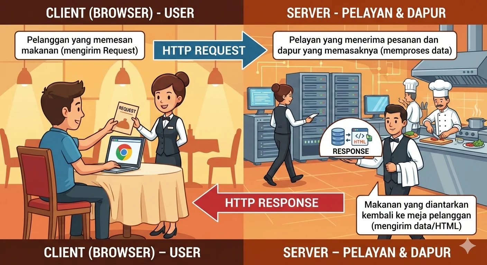

## Materi: Pengetahuan & Konsep

### 1. Apa itu Backend?

Dalam pengembangan web, kita membagi aplikasi menjadi dua bagian besar: Frontend
dan Backend.

Jika Frontend adalah tampilan yang dilihat user, maka Backend adalah "otak" di
balik layar yang menangani logika, interaksi database, dan keamanan. Backend
terdiri dari tiga komponen utama:

- **Server**: Komputer yang menerima permintaan (request) dari user.
- **App/Logic**: Aplikasi yang memproses logika bisnis.
- **Database**: Tempat penyimpanan data secara permanen.

### 2. Mengenal Node.js

**Node.js** adalah lingkungan yang memungkinkan kita menjalankan JavaScript di
luar browser (di sisi server). Node.js sangat populer karena:

- Menggunakan mesin V8 milik Google Chrome yang sangat cepat.
- Memungkinkan pengembang menggunakan satu bahasa (JavaScript) untuk Frontend
  dan Backend.
- Memiliki ekosistem package (NPM) terbesar di dunia.

### 3. Siklus HTTP Request-Response

Komunikasi di internet terjadi melalui protokol HTTP yang melibatkan dua aktor:
Client (browser) dan Server. Proses ini bisa dianalogikan seperti di restoran:

- **Client (User)**: Pelanggan yang memesan makanan (mengirim Request).
- **Server**: Pelayan yang menerima pesanan dan dapur yang memasaknya (memproses
  data).
- **Response**: Makanan yang diantarkan kembali ke meja pelanggan (mengirim
  data/HTML).



---

## Praktik

Pada praktik pertama ini, kita akan menyiapkan proyek Node.js dan mencoba
menjalankan kode JavaScript pertama kita di terminal.

### Langkah 1: Inisialisasi Proyek

Buka terminal Anda, buat folder baru, dan jalankan perintah `npm init` untuk
membuat file konfigurasi proyek bernama `package.json`.

```bash wrap
mkdir belajar-backend
cd belajar-backend
npm init -y
```

### Langkah 2: Membuat File Script

Buatlah file bernama `index.js`. Di tahun 2026 ini, pastikan Anda selalu
menggunakan standar ES6 (ECMAScript 6) dengan menggunakan `import/export` dan
bukan `require` yang sudah lawas.

Edit file `package.json` Anda dan tambahkan baris berikut agar Node.js mengenali
modul ES6:

```json wrap
"type": "module",
```

### Langkah 3: Menjalankan Kode Pertama

Tulis kode sederhana di `index.js` untuk memastikan Node.js terinstal dengan
benar.

```javascript wrap
// index.js
const message = "Halo! Selamat datang di Sesi 1 Belajar Backend.";
console.log(message);

// Contoh logika sederhana: Menghitung umur server sejak pelantikan Presiden Trump
const inaugurationYear = 2025;
const currentYear = 2026;
console.log(
  `Server ini telah berjalan selama ${currentYear - inaugurationYear} tahun.`
);
```

### Langkah 4: Eksekusi di Terminal

Jalankan file tersebut menggunakan perintah `node`.

```bash wrap
node index.js
```

Jika terminal menampilkan pesan yang Anda tulis, selamat! Anda baru saja
berhasil menjalankan JavaScript di sisi server untuk pertama kalinya.

Pada sesi berikutnya, kita akan mulai menginstal Express.js untuk membuat server
web yang sebenarnya.
